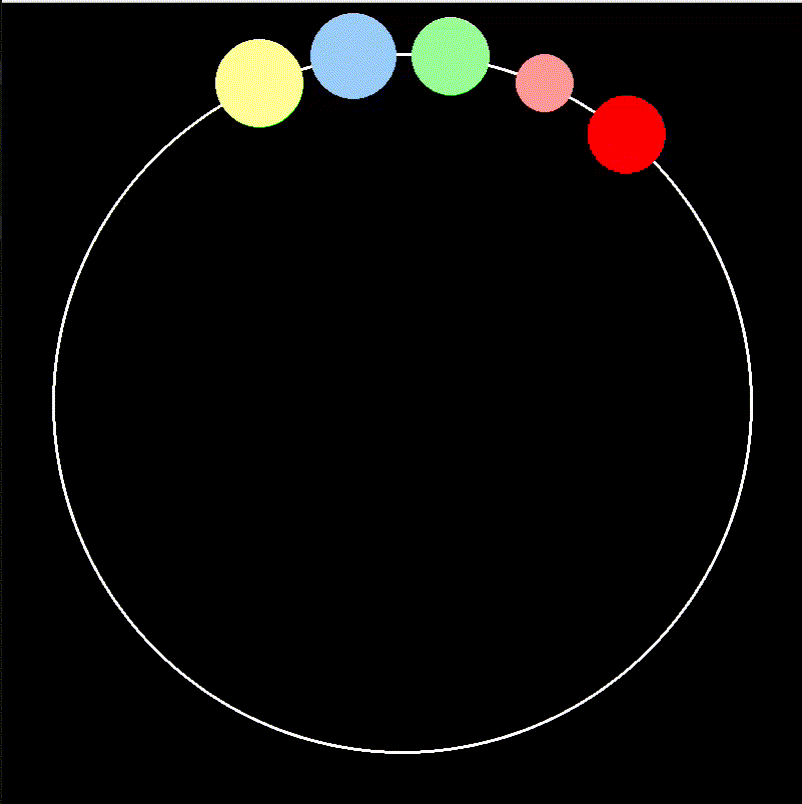

# Bead-on-a-Wire Simulation With Position Based Dynamics

- iterative resolution of constraints (distance and collision)

- inspired by this amazing video by TenMinutePhysics: https://www.youtube.com/watch?v=qISgdDhdCro

## Demo

- NOTE: runs a lot smoother than the GIF suggests
